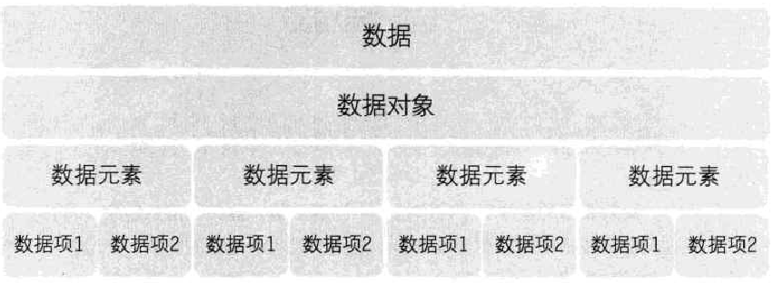
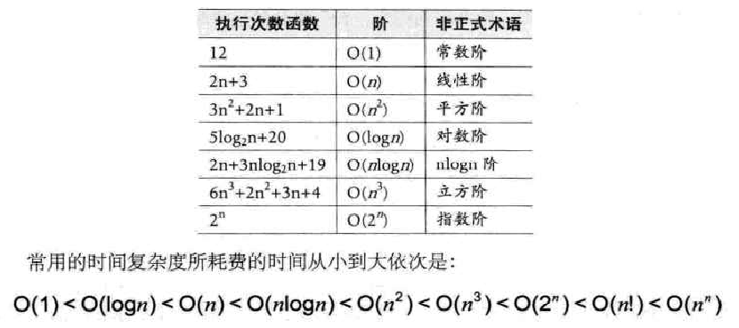

## 术语

*   数据

    *   是描述客观事物的符号，是计算机中可以操作的对象，是能被计算机识别，并输入给计算机处理的符号集合。
    *   就是符号
        *   可以输入到计算机中
        *   能被计算机程序处理

*   数据元素

    *   是组成数据的、有一定意义的基本单位，在计算机中通常作为整体处理。也被称为记录。
    *   是数据结构中建立数据模型的着眼点。

*   数据项

    *   一个数据元素可以由若干个数据项组成。
    *   是数据不可分割的最小单位

*   数据对象

    *   是性质相同的数据元素的集合，是数据的子集
    *   简称数据

*   数据结构

    *   数据结构:是相互之间存在一种或多种特定关系的数据元素的集合

    

## 逻辑结构

```mermaid
graph TB
逻辑结构 --> 集合结构
逻辑结构 --> 线性结构
逻辑结构 --> 树形结构
逻辑结构 --> 图形结构
```


*   集合结构
*   线性结构
*   树形结构
*   图型结构


## 存储结构

```mermaid
graph LR
1[存储结构] --> 2[顺序 : 数组]
1[存储结构] --> 3[链式 : 结构体]
```

## 数据操作

*   增删改查
*   遍历
    *   迭代 + 递归

## 算法

### 基本特性

*   输入输出
    *   输入：算法具有零个或多个输入
    *   输出 ： 算法至少有一个或多个输出
*   有穷性
    *   指算法在执行有限的步骤之后，自动结束而不会出现无限循环，并且每一个步骤在可接受的时间内完成。
*   确定性
    *   算法的每一步骤都具有确定的含义，不会出现二义性
*   可行性
    *   算法每一步，都要能够执行，有限次数能够运行出结果

### 时间复杂度

*   分析
    *   直接是看多少次

*   大 O 阶
    *   用常数 1 取代运行时间中的所有加法常数。
    *   在修改后的运行次数函数中，只保留最高阶项。
    *   如果最高阶项存在且不是 1 ，则去除与这个项相乘的常数。
    *    n 按照无限大来计算比价




## 注意

```go
节点 结点
这两个基本没有硬性规定必须在那种情况下使用谁，正常情况是通用表达一个意思
// 有的书上说：结点用于树，具体我也没考究，毕竟不是语文题。。。。
```


## 学习路线

*   数据结构——编译原理——数值分析


## 参考

* 大话数据结构

