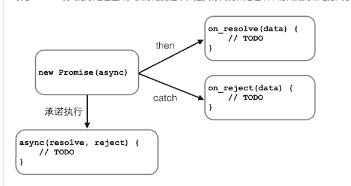

## 关键字

### let - 变量

```js
作用
	声明一个变量 ，和 var 相似
特点
	在扩作用于内有效
    不能重复声明
    不会预处理(提升)，不存在提升
应用
	循环遍历加监听
    使用 let 取代 var 是趋势

var a = 123
let a = 123
```

### const - 常量

```js
作用
	声明一个常量
特点
	一旦 const 修饰的标识符被赋值之后，不能修改
    使用 const 定义标识符，必须要赋值
    常量的含义是指向的对象不能修改，但是可以修改对象内部的属性
    const obj = {
        name :"122",
        age:18
    }
    obj.age = 20  // 是可以进行修改的
    其他跟 let 相同
应用
	保存不变的数据
```

### 变量的解析构值

```js
解构
	从对象或数组中提取数据，并赋值给变量(多个)
对象
	let {n,a} = {n:'tom',a:12}
数组
	let [a,b] = [1,abc]
用途
	给多个形参赋值
```

## 字符串

*   模板字符串

    ```js
    // 简化字符串的拼接
    使用
    	模板字符串必须使用 `  ` 包含
        变化部分使用 ${xxx} 定义
    使用
    	let obj = {name:'lili',age:'18'}
        let str = `我的名字叫：${obj.name} ， 年龄是：${obj.age}`
    ```

## 对象

### 简化写法

```js
省略同名的属性值
省略方法同 function


let username = 'kobe'
let age = 39
let obj {
    username,
    age,
    getName(){
        return this.username;
    }
}

// 原始没有改变的情况
let obj {
    username：username,  // 这个就是全局变量的 username
    age:age,			// 这个就是全局变量的 age
    getName:function(){
        return this.username;
    }
}
```

### 面向对象

```js

```


## 函数

### 匿名函数

```js
箭头函数
作用
	定义匿名函数
语法
	let 函数名 = (参数) => {函数体}；
特点
	1. 语法间接
    2. 箭头函数没有自己的 this , 箭头函数的 this 不是调用的时候决定的，而是定义的时候所处的对象就是 this
		()=>  外层有函数，则 箭头函数的 this 和外层函数的一致
    	()=>  外层没有函数，则 箭头函数的 this 值得就是 window
    
    let obj={
        name :'箭头函数'，
        getName:function(){
            btn.onclick = () => {alert(this)} // 此时箭头函数的 this 外层函数就是 getName 的this
        }
    }
    
    
形参情况
	1. 没有形参
    	let fun = () => console.log("这是匿名函数内部执行的语句")
    2. 有参数 (只有一个参数可省略参数括号)
    	let fun = (a,b) => console.log(a,b)           	
       	let fun = a => console.log(a)
      
     4 函数体
     	大括号包围 ， 记得手动 return 
     	// 只有一条语句或者是表达体，省略表达式相当于自动返回语句/表达式执行的结果
		let fun = (x,y) => x + y;
		let fun = (x,y) => {return x + y;}
        
        
     	
```


### 三点运算符

```js
// 扩展运算符，剩余运算符

// rest(可变)参数 ，用来取代 arguments , 但是比 argument 灵活，只能是最后部分形参参数
// ...value 中的 value 是一个真数组，可以使用 数组的方法
function foo(a,...value) {
    console.log(value)		// 这个是最后部分的参数
    consolse.log(arguments)  // 这个是全部参数
}
foo(3,4,5,6)  //  这里 value 就是 数组 4,5,6


// 扩展运算符
let arr = [1,6]
let arr1 = [2,3,4,5]
arr = [1 , ...arr1 , 6]
arr.push(...arr1)

console.log(...arr)  // 得到的就是 arr1
```

### 形参默认值

```js
// 形参的默认值
	当不传入参数的死活，使用形参里面的默认值
    
function Point(x=1,y=2){
    this.x = x
    this.y = y
}

let Point = new Point(3,5)  // 这里 x 就是 3， y 就是 5
let Point = new Point()	    // 这里 x 就是 1， y 就是 2
```


## promise对象

*   介绍

    *   promise 对象，代表了将来某个要发生的事情（通常是一个异步操作）
    *   有了 promise 对象，可以将异步操作以同步的流程表达出来，避免层层嵌套的回调函数(俗称：回调地狱)

*   使用

    ```js
    1. 异步编程的一种解决方案
    2. 我们封装一个网络请求的函数，因为不能立即拿到结果，所以需要传入另一个函数，在数据请求成功的时候，将数据通过传入的函数回调出去
    3. 当网络请求非常复杂的时候，就会出现回调地狱 
    
    // 链式编程
    套娃边串娃
    // 使用
    	有异步操作的时候，使用 promise 封装
    ```

    

*   demo

    
    
    ```js
    // Promise()   是一个构造函数，用来生成一个 Promise 实例
    
    promise 对象的状态
        pending : 初始化的状态,等待状态
        fullfilled : 成功的状态
        rejected : 失败的状态
        
    应用
    	实现超时处理
    
     // 创建 promise 对象
    let promise = new Promise((resolove,reject) => {
        // 初始化 promise 状态为 pending    
        
        if (异步操作成功) {
            resovle(value); // 修改 promise 的值为fullfilled
        } else {
            reject(errMsg);  // 修改 promise 的值为 rejected
        }
    })
    //调用 promise 的then 
    promise
    	.then((data)=>{console.log(data)},(error)=>{})
    //-----------------------------------------------------------------------------
    
    
    // promise 链式地调用
    new Promise((resolve,reject) =>{
        setTimeOut(()=>{
            reselve('aaa')
        },1000)
    }).then(res => {
        console.log("第一层代码");
         return Promise.resolv(res+'111')
    }).then(res =>{
        console.log("第二层代码");
        return Promise.resolv(res+'222')
    }).then(res => {
        // 第三层演示吧报错
         return Promise.reject(err message)
        // throw 'err message'  也可以
    }).catch(res => {
        console.log(err);
    })
    
    //---------------------------------------------------------
    
    // 超时例子
    // 创建 promise 对象 ，promise 进行判断 then 是执行代码
    // resolove reject 本身就是也是一个函数
    let promise = new Promise((resolve,reject) => {
        // 初始化 promise 状态为 pending
        
        // 执行 异步操作 ,通常是发送 ajax 请求，开启定时器
        setTimeout(()=>{
    
            // 根据异步任务的返回结果来修改 promise 的状态
            // 异步任务执行成功 ，调用 resolve 的时候就会调用 then
            resolve("data");   // 修改 promise 的状态为 fullfilled 成功的状态
            // 异步任务失败
            reject();  // 执行这个, 把error 传给 then 
        })
    }，2000).then((data)=>{  // 成功回调执行的代码
        
        // .then (函数1，函数2)   回调成功执行函数1 回调从失败执行函数2  
    	}).catch((err) => { // 失败的回调执行的代码
            console.log(err)
        })
        	
        
        
    // -----------------------------------------------------------------------
    
    // new Promise(resolve => resolve(结果))
    
    
    // 实际例子 ajax 
    function getNews(url){
    
        // 创建 promise 对象
        let promise = new Promise((resolove,reject) => {
            // 初始化 promise 状态为 pending
    
            // 创建  xmlHttp 对昂
            let xmlHttp = new XMLHttpRequest();
            //绑定监听,注意这个要调用 4 次
            xmlHttp.onreadstatechange = function(){
                if (xmlhttp.readyState === 4 {
                    if (xmlHttp.status === 200)){
                    	//请求成功
                        console.log(xmlHttp.responseText)
                        // 修改状态
                        resolve(xmlHttp.responseText);  // 修改 promise 的值为fullfilled
              		} else {
                        // 请求失败
                        reject('暂时没有新闻内容');
           		 }
           	 	}
    
    	xmlHttp.open('GET',url);
            
        })
        return promise;
    }
    
    getNews(url)
    	.then((data) => {
    		console.log(data)
    	    // 从获取的data内容里面进行处理，注意这里的 data 是 JSON 字符串，解析后发送url
            let commentsUrl = Json.parse(data).commentsUrl
            let url = "http://..."
            return getNews(url)  // 这里注意要防止回调地狱
    	}，(error) => {
        	console.log(error);
    	})
        .then((data)=>{console.log(data)},(error)=>{})
    // ---------------------------------
    // 处理异步请求，
    Promise.All([
        new Promise((resolve,reject) => {
            $ajax({
                url:'',
                success:function(){
                    console.log("结果1")
                }
            })
        })，
        new Promise((resolve,reject) => {
            $ajax({
                url:'',
                success:function(){
                    console.log("结果2")
                }
            })
        })，
        // 前面所有请求完成，才会执行下面的then
    ]).then(results => {
        // result[0]  是第一个new Promise 的结果，类推
    })
        
    ```
    
    


## symbol属性

*   介绍

    *   ES5 中对象的属性名都是字符串，容易造成重名，污染环境

    *   ES6 中添加了一种原始数据类型 symbol

        （原来有 number string boolean null defined object）

*   特点

    *   symbol 属性值对应的值是唯一的，解决命名冲突问题

    *   symbol 值不能和其他数据进行计算，包括同名字符串拼接

        ```js
        自身不等于自身
        let sy1 = Symbol()
        let sy2 = Symbol()
        console.log(sy1 == sy2)  // false
        console.log(sy1,sy2)    // Symbol()  Symbol()
        ```

        

    *   for in ,for of 遍历的时候不会遍历 symbol 属性

*   使用 

    ```js
    1. 调用 symobol 函数得到 symbol 值
    	let  symbol = Symbol();
    	let obj = {userName:'kobe'}
        obj[symbol] = 'hello'   // obj {userName:'kobe' , Symbol:'hello'}
    	
    2. 传参标识
    	let sy1 = Symbol('1')
    	let sy2 = Symbol('2')
        console.log(sy1,sy2)  // Symbol(1)  Symbol(2)
    	
    	// 定义常量
    	const perspm_key = Symbol('person_key') 
        console.log(perspm_key)   // Symbol(person_key) 
    
    3. 内置 symbol 值
    	内置 11 个 Synbol 值，指向语言 内部使用的方法
    	
    ```


## itorator接口

```js
介绍
	一种接口机制机制，为不同的 数据提供统一的访问机制
  
作用
	为各种数据结构的成员能够按某种次序排列
    使得数据结构的成员能够按照某种次序排列
    使用一种新的遍历命令 for...of
工作原理
	创建一个指针对象(遍历器对象)，指向数据结构的起始位置
    第一次调用 next 方法，指针会自动指向数据结构的第一个成员
    接下来不断调用 next 方法，指针会一直往后移动，直到指向最后一个成员
    每次调用 next 方法返回的是一个包含 value 和 node 的对象，{value:当前成员值，done:布尔值}
		value 表示当前成员的值
         done   表示当前数据是偶遍历结束
         当遍历结束的时候，返回的 value 为 undefined ，done 为 false

	原生具备 iterator 接口的数据(可用 for of 遍历)

// 模拟
// 遍历器对象（模拟指针对象）
function myInterator(arr){
    let nextIndex = 0
    return {
        next:function(){
			return {value:arr[nextIndex++],done:false}
        }
    }
}
let arr = [1,2,3]
let interatorObj = myInterator(arr)
```


